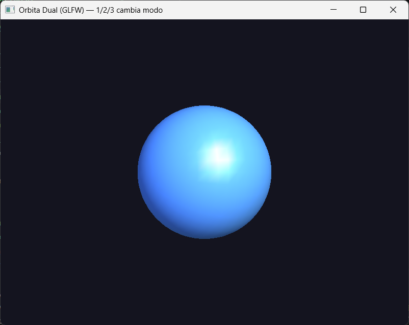
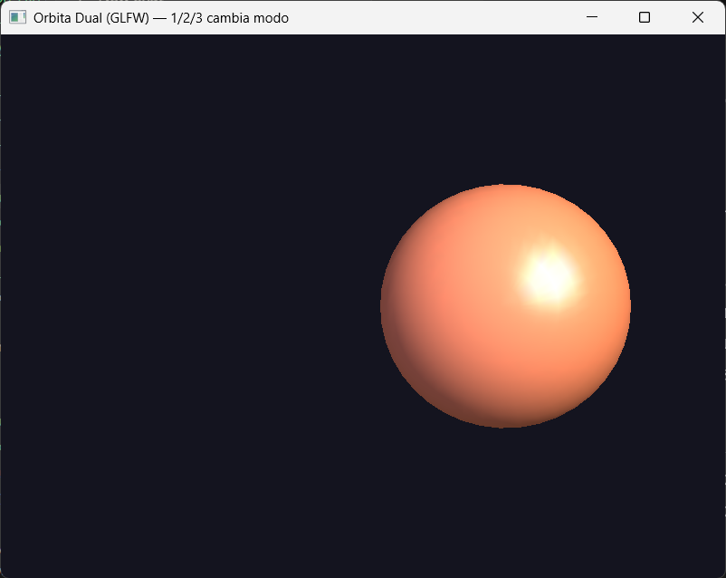
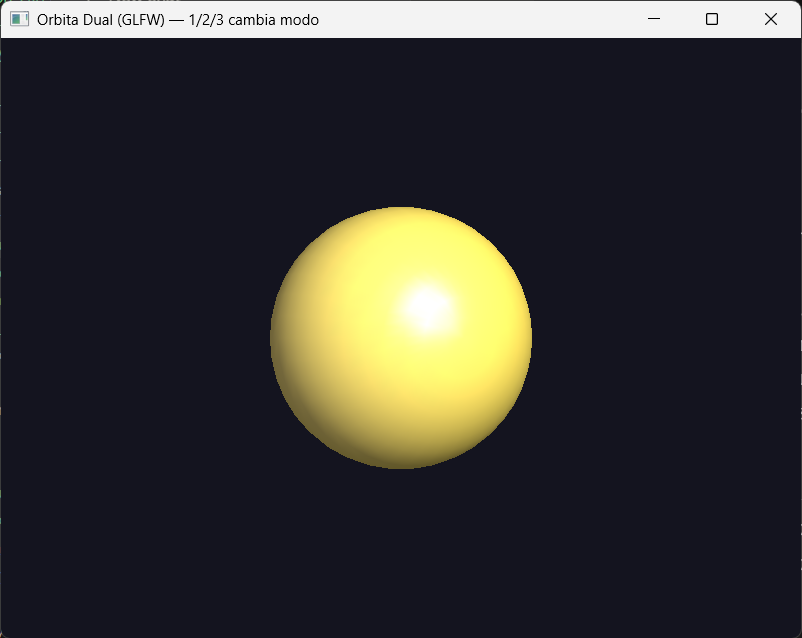

# Reporte de Misión: Órbita Dual (Cámara vs Objeto)

**Agente Especial:** Diego Santiago Zavala Urueta
**Profesor:** Jesus Eduardo Alcaraz Chavez
**Materia:** Graficación

---

## Evidencias

### Misión 1 — Rotar Objeto vs Orbitar Cámara

| Objeto rota (Modo 1) | Cámara orbita (Modo 2) |
|:-:|:-:|
|  |  |

**Código:**

```python
def render_rotating_object(angle):
    glMatrixMode(GL_MODELVIEW)
    glLoadIdentity()
    glTranslatef(0.0, 0.0, -CAM_DISTANCE)  # cámara fija
    glRotatef(angle, 0.0, 1.0, 0.0)        # objeto rota
    glColor3f(0.35, 0.65, 1.0)
    draw_sphere(1.0)

def render_orbiting_camera(angle):
    glMatrixMode(GL_MODELVIEW)
    glLoadIdentity()
    glRotatef(-angle, 0.0, 1.0, 0.0)   # vista rota (signo invertido)
    glTranslatef(0.0, 0.0, -CAM_DISTANCE)
    glColor3f(1.0, 0.55, 0.35)
    draw_sphere(1.0)
```

**Comparación de variantes (Modo 2):**
`render_orbiting_camera` usa `rotate(-a) → translate(-Z)`: la cámara orbita correctamente alrededor del objeto estático.
`render_orbiting_camera_variant_b` usa `translate(-Z) → rotate(+a)`: visualmente es idéntico al Modo 1 (objeto girando), porque invertir el orden y el signo produce la misma matriz resultante que rotar el objeto.

---

### Misión 2 — gluLookAt

| LookAt órbita (Modo 3) |
|:-:|
|  |

**Código:**

```python
def render_with_lookat(angle):
    glMatrixMode(GL_MODELVIEW)
    glLoadIdentity()
    a = math.radians(angle)
    cam_x = ORBIT_RADIUS * math.sin(a)
    cam_z = ORBIT_RADIUS * math.cos(a)
    gluLookAt(cam_x, 0.0, cam_z,   # posición del ojo
              0.0,   0.0, 0.0,     # objetivo (origen)
              0.0,   1.0, 0.0)     # vector "arriba"
    glColor3f(0.95, 0.85, 0.35)
    draw_sphere(1.0)
```

---

### Misión 3 — Iluminación

| Luz activa |
|:-:|
|  |

**Notas:**
Con `USE_LIGHTING = True` y la posición de la luz definida antes de `glRotatef`, la luz queda fija en el mundo. Al rotar el objeto en Modo 1 las sombras cambian con el ángulo, dando sensación real de volumen. En Modo 2 (cámara orbita) ocurre lo mismo: la luz permanece fija y la esfera se ilumina de forma consistente sin importar la posición de la cámara.

---

## Análisis del Analista

**1. Orden de matrices**
En OpenGL fijo las transformaciones se acumulan multiplicando la matriz actual por la derecha, lo que significa que la última transformación escrita es la primera en aplicarse al vértice. Por eso `translate + rotate` produce un resultado distinto a `rotate + translate`: en el primer caso el objeto se desplaza y luego gira alrededor del nuevo origen; en el segundo, gira en su lugar y luego se desplaza.

**2. Objeto vs cámara**
Rotar el objeto es preferible cuando se quiere inspeccionar un modelo desde un punto de vista fijo, como en visualizadores de productos o editores 3D. Orbitar la cámara es mejor para explorar una escena estática, como en videojuegos o recorridos arquitectónicos, donde el mundo no debe moverse.

**3. gluLookAt vs translate+rotate**
`gluLookAt` describe la cámara en términos intuitivos (ojo, objetivo, arriba), lo que facilita la comunicación en equipos: cualquier persona entiende "la cámara está en (5,0,0) mirando al origen" sin necesidad de razonar sobre el orden de transformaciones. Con `translate+rotate` hay que conocer el orden exacto y el signo correcto, lo que es propenso a errores.

**4. Luces**
Si la luz se define en coordenadas de cámara (justo tras `glLoadIdentity`, antes de cualquier transformación) y luego se rota solo el objeto, la luz sigue a la cámara. El resultado es que las sombras no cambian al rotar el objeto, haciéndolo parecer plano o iluminado de forma irreal, como si la luz estuviera pegada al ojo del observador.