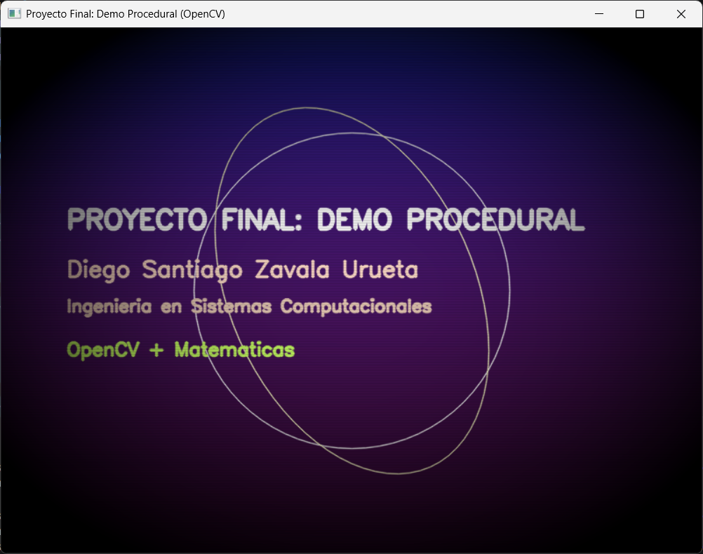
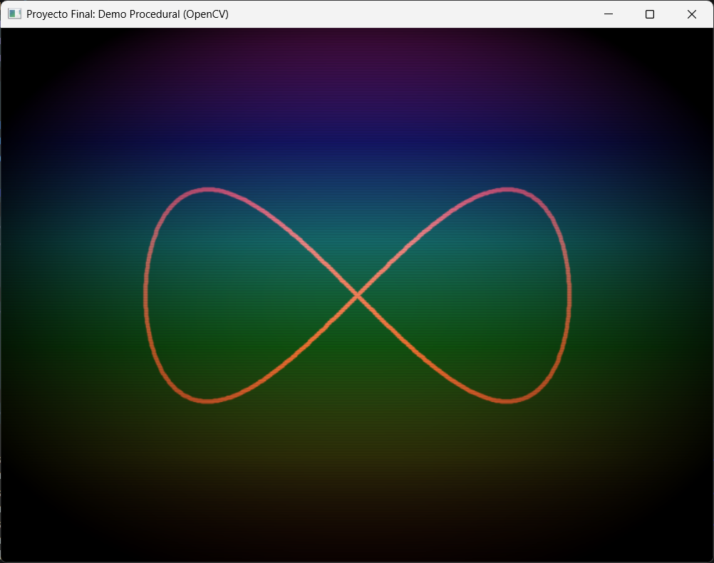
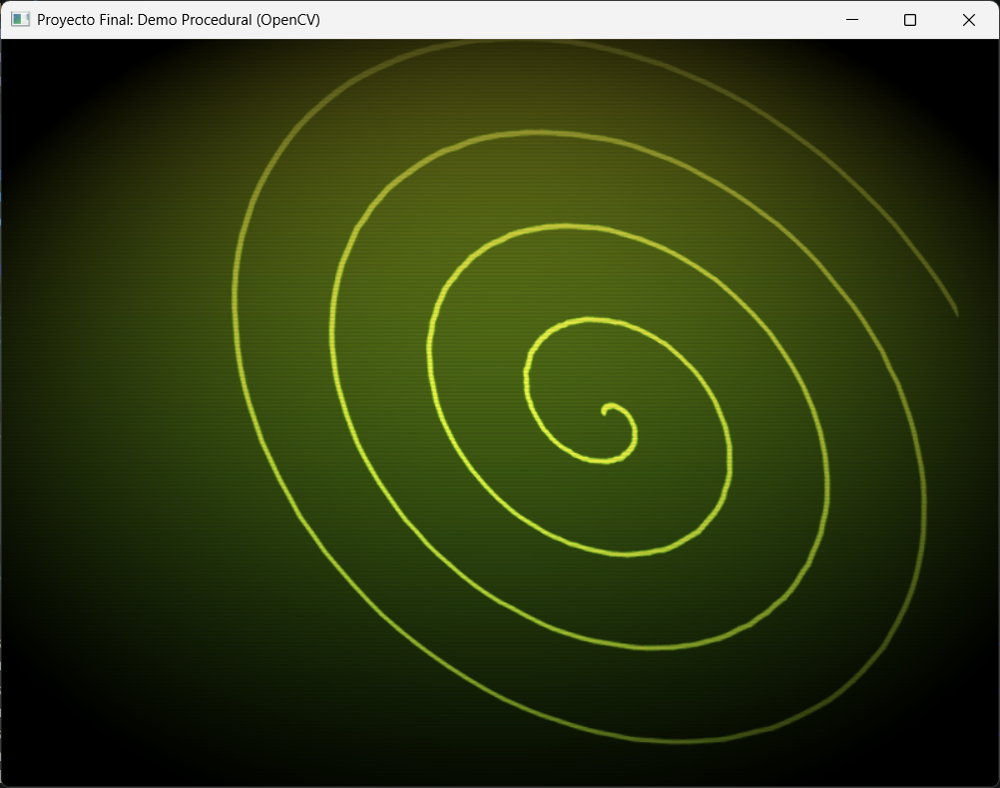
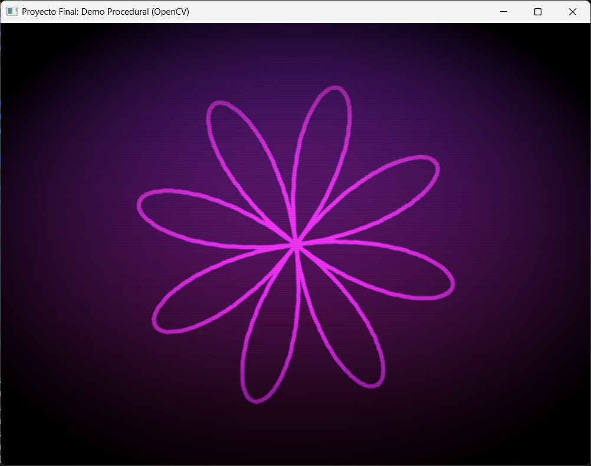
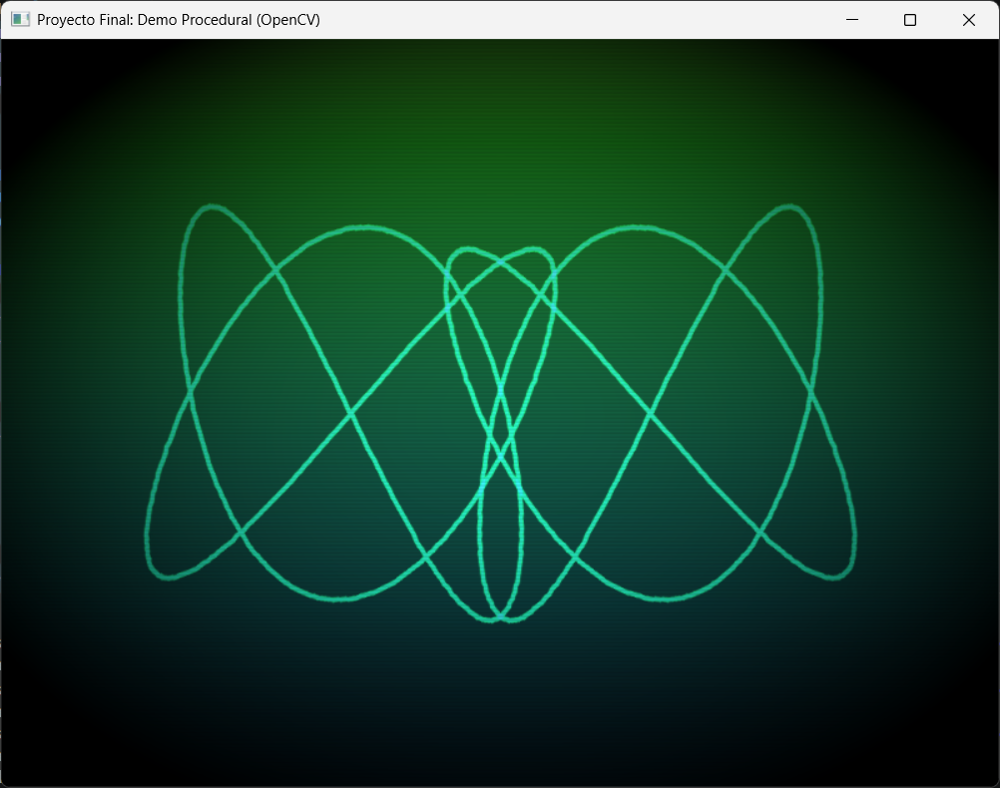
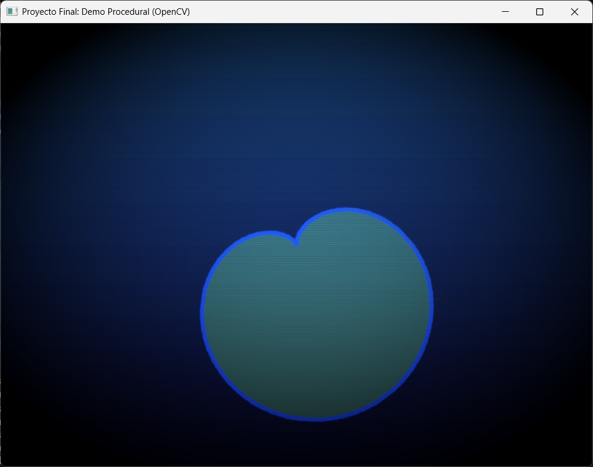
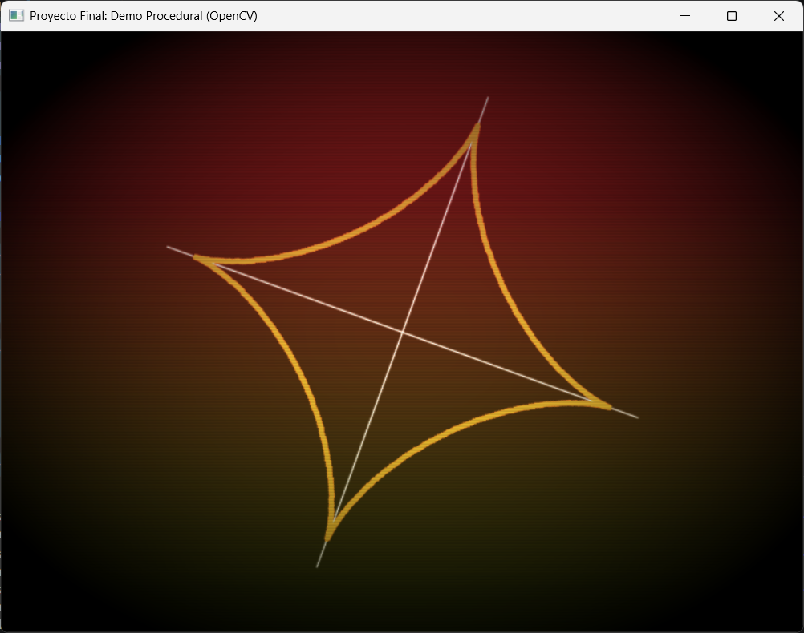
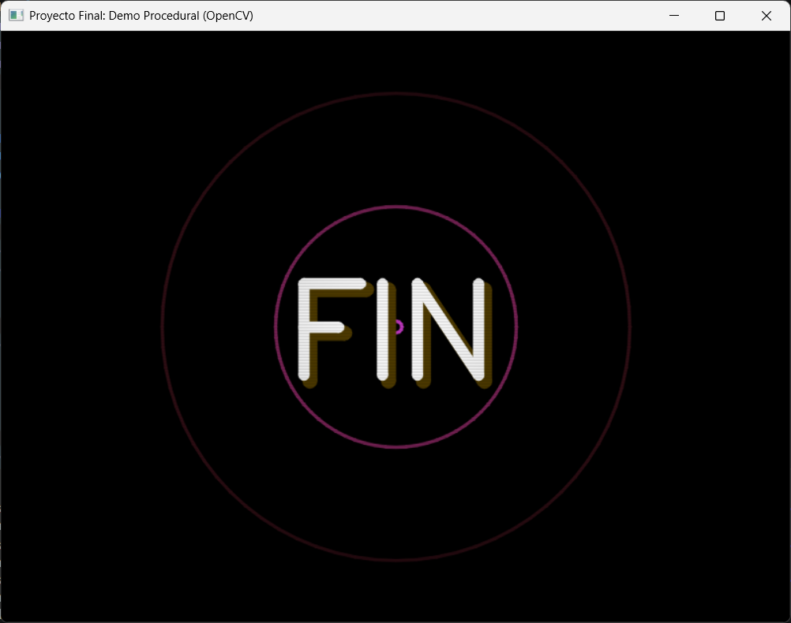

# Proyecto Final: Demo Procedural con OpenCV (Proyecto 1)

**Nombre:** Diego Santiago Zavala Urueta  
**Materia:** Graficación  
**Profesor:** Jesus Eduardo Alcaraz Chavez

---

## ¿Cómo correr el proyecto?

**Requisitos:**
```bash
pip install numpy opencv-python
```

**Ejecutar:**
```bash
python demo_procedural.py
```

**Exportar video:**
El video se exporta automáticamente como `demo_procedural.mp4` en la misma carpeta al correr el script. También se muestra en pantalla en tiempo real. Para cerrar antes de terminar presiona `ESC`.

**NOTA:** Se debe de dejar reproducir por completo el DEMO cuanto se esté corriendo el código, ya que si no se deja correr completo el video, puede haber fallos al exportar por completo el video.

---

## Capturas por Escena

| Escena | Captura |
|--------|:-------:|
| 1 — Créditos / Intro |  |
| 2 — Lemniscata |  |
| 3 — Espiral de Arquímedes |  |
| 4 — Rosa Polar |  |
| 5 — Lissajous |  |
| 6 — Cardioide |  |
| 7 — Astroide |  |
| 8 — Outro / FIN |  |

---

## Reporte

### Timeline de Escenas

El demo dura 56 segundos divididos en 8 bloques de 7 segundos cada uno:

| Tiempo | Escena | Descripción |
|--------|--------|-------------|
| 0 – 7s | 1 — Créditos | Texto flotante con traslación sinusoidal, círculo y elipse animados |
| 7 – 14s | 2 — Lemniscata | Curva de Gerono con rotación y escala pulsante |
| 14 – 21s | 3 — Espiral | Espiral de Arquímedes con rotación + shear |
| 21 – 28s | 4 — Rosa Polar | Rosa polar k=4 con rotación continua |
| 28 – 35s | 5 — Lissajous | Figura de Lissajous con rotación + espejo |
| 35 – 42s | 6 — Cardioide | Cardioide rellena con fillPoly + rotación |
| 42 – 49s | 7 — Astroide | Astroide con ejes decorativos + rotación |
| 49 – 56s | 8 — Outro | Anillos expansivos + texto "FIN" con pulso |

Las transiciones entre escenas alternan entre 4 tipos: fade suave, flash blanco, barrido izquierda→derecha y barrido derecha→izquierda.

---

### Ecuaciones Paramétricas Usadas

**1. Lemniscata de Gerono**
```
x(t) = sin(t)
y(t) = sin(t) · cos(t)
t ∈ [0, 2π]
```

**2. Espiral de Arquímedes**
```
x(t) = t · cos(t)
y(t) = t · sin(t)
t ∈ [0, t_local × 5]
```

**3. Rosa Polar (k=4)**
```
x(t) = cos(4t) · cos(t)
y(t) = cos(4t) · sin(t)
t ∈ [0, 2π]
```

**4. Lissajous (a=3, b=2)**
```
x(t) = sin(3t)
y(t) = sin(2t)
t ∈ [0, 2π]
```

**5. Cardioide**
```
r(t) = 1 - cos(t)
x(t) = r(t) · cos(t)
y(t) = r(t) · sin(t)
t ∈ [0, 2π]
```

**6. Astroide**
```
x(t) = cos³(t)
y(t) = sin³(t)
t ∈ [0, 2π]
```

Todas las curvas se dibujan con `cv2.polylines` sobre un buffer temporal que luego se mezcla con el fondo.

---

### Transformaciones Implementadas

**1. Rotación (`cv2.getRotationMatrix2D` + `cv2.warpAffine`)**
Usada en todas las escenas de curvas (1–6). Se genera una matriz de rotación 2x3 centrada en el centro del frame y se aplica con `warpAffine`. El ángulo varía con el tiempo (`t * velocidad`) para producir rotación continua.

```python
M = cv2.getRotationMatrix2D((W / 2, H / 2), t * 40, 1.0 + 0.2 * math.sin(t * 2))
cv2.warpAffine(temp, M, (W, H))
```

**2. Shear (cizallamiento)**
Aplicado en la Escena 2 (Espiral). Se construye manualmente una matriz afín 2x3 con un coeficiente de shear variable en el tiempo:

```python
M_shear = np.float32([[1, 0.3 * math.sin(t * 2), 0], [0, 1, 0]])
cv2.warpAffine(rotated, M_shear, (W, H))
```

**3. Espejo horizontal**
Aplicado en la Escena 4 (Lissajous). Se construye una matriz afín que invierte el eje X:

```python
M_mirror = np.float32([[-1, 0, W], [0, 1, 0]])
cv2.warpAffine(rotated, M_mirror, (W, H))
```

**4. Escala pulsante**
Aplicada en la Escena 1 (Lemniscata). El factor de escala oscila con una función sinusoidal:

```python
escala = 1.0 + 0.2 * math.sin(t * 2)
M = cv2.getRotationMatrix2D((W / 2, H / 2), t * 40, escala)
```

---

### Filtros / Post-procesamiento

**1. Viñeta (`post_vignette`)**
Se genera una máscara radial en NumPy que oscurece los bordes del frame. Simula el efecto de lente de una cámara analógica y enfoca la atención al centro:

```python
r2 = nx*nx + ny*ny
mask = np.clip(1.0 - strength * r2, 0.0, 1.0)
```

**2. Scanlines (`post_scanlines`)**
Se aplica un patrón de líneas horizontales tenues usando una función seno, simulando el aspecto de un monitor CRT vintage. Aporta coherencia estética a todas las escenas.

**3. Composición por capas (`cv2.addWeighted`)**
Cada escena dibuja sus curvas sobre un buffer temporal y lo mezcla con el fondo usando `addWeighted`, permitiendo que los colores del fondo y la curva interactúen sin sobreescribirse.

---

## Conclusión

Este demo procedural demuestra que es posible construir animaciones visualmente ricas usando únicamente matemáticas y primitivas de dibujo, sin recurrir a imágenes externas ni modelos importados. Cada escena es una función autónoma que recibe el tiempo `t` y produce un frame, lo que facilita el mantenimiento y la extensión del código. Las curvas paramétricas permiten describir formas complejas con ecuaciones simples, y las transformaciones afines aplicadas sobre buffers temporales dan dinamismo sin necesidad de recalcular cada punto en cada frame. El sistema de timeline con transiciones diferenciadas da coherencia narrativa al conjunto y demuestra el uso de `addWeighted` como herramienta de composición.