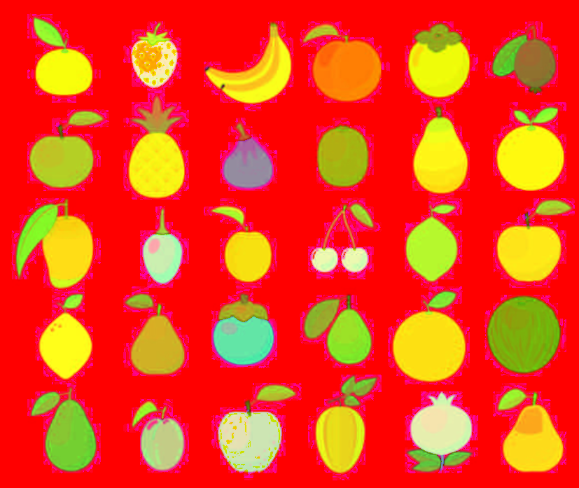
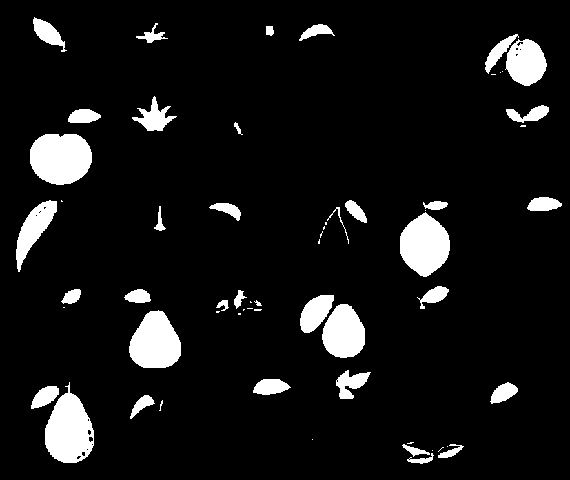
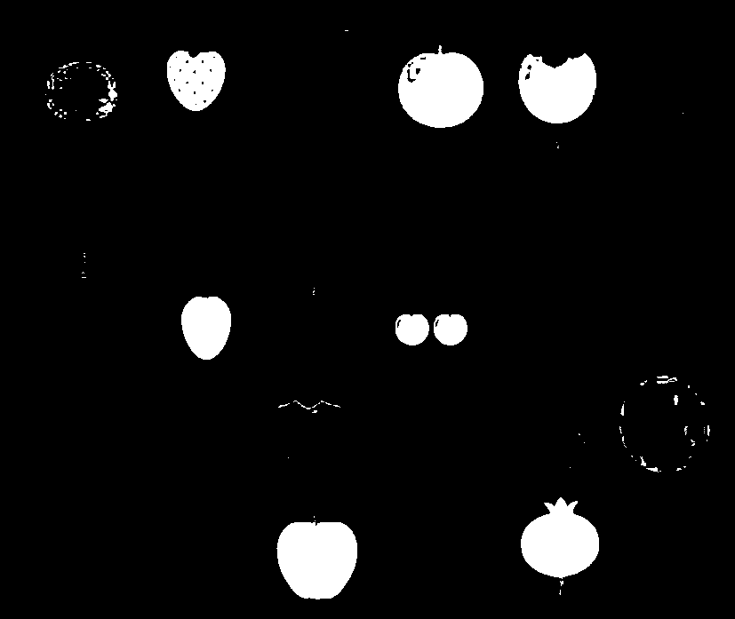
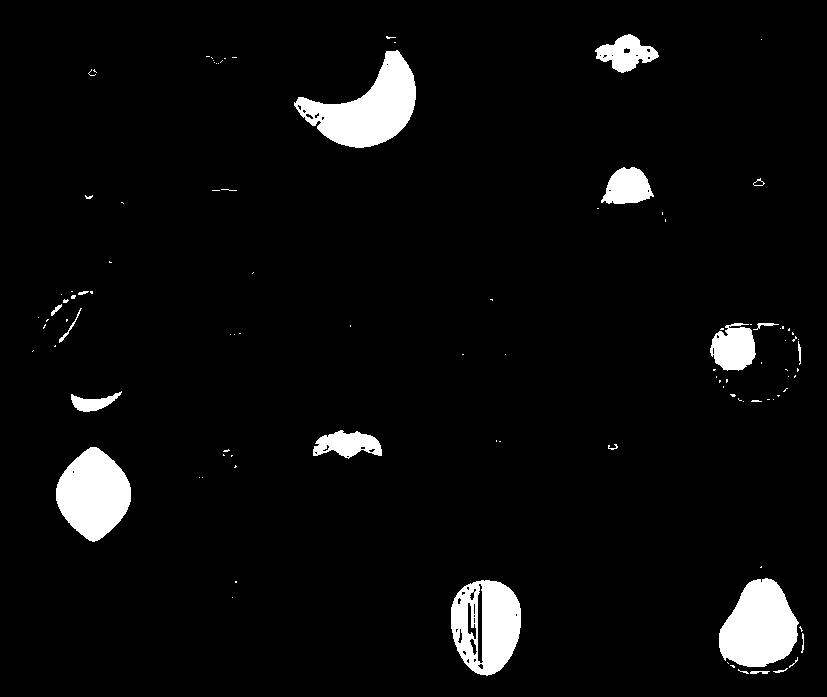
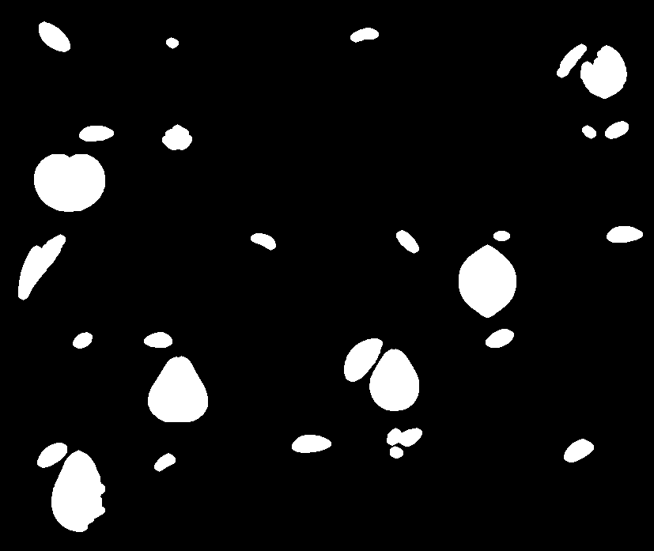

# Reporte — Segmentación de Frutas usando Máscara HSV

**Nombre:** Diego Santiago Zavala Urueta

**Profesor:** Jesus Eduardo Alcaraz Chavez

**Materia:** Graficación

---

## Actividad 1 — Exploración del Espacio HSV

### Código

```python
import cv2 as cv
import numpy as np

img = cv.imread('frutas.png')
hsv = cv.cvtColor(img, cv.COLOR_BGR2HSV)

lower_green  = np.array([35, 100, 100]);  upper_green  = np.array([85,  255, 255])
lower_red1   = np.array([170, 100, 100]); upper_red1   = np.array([180, 255, 255])
lower_red2   = np.array([0,  100, 100]);  upper_red2   = np.array([10,  255, 255])
lower_yellow = np.array([25, 100, 100]);  upper_yellow = np.array([35,  255, 255])

mask_green  = cv.inRange(hsv, lower_green,  upper_green)
mask_red    = cv.inRange(hsv, lower_red1, upper_red1) | cv.inRange(hsv, lower_red2, upper_red2)
mask_yellow = cv.inRange(hsv, lower_yellow, upper_yellow)
```

### Evidencia Visual

| Original | HSV |
|:-:|:-:|
|  |  |

| Máscara Verde | Máscara Roja | Máscara Amarilla |
|:-:|:-:|:-:|
|  |  |  |

### Reflexión

**¿Qué ocurre cuando el rango es muy estrecho?**
La máscara deja de detectar píxeles válidos de la fruta cuyo tono varía por iluminación o sombra, generando regiones fragmentadas o incluso sin detección.

**¿Qué ocurre cuando el rango es muy amplio?**
La máscara empieza a activar píxeles de otros objetos con colores cercanos, mezclando frutas de distintos colores y dificultando el conteo.

---

## Actividad 2 — Limpieza de Ruido

### Código

```python
kernel = cv.getStructuringElement(cv.MORPH_ELLIPSE, (7, 7))
mask_green_clean  = cv.morphologyEx(mask_green,  cv.MORPH_OPEN, kernel, iterations=2)
mask_red_clean    = cv.morphologyEx(mask_red,    cv.MORPH_OPEN, kernel, iterations=2)
mask_yellow_clean = cv.morphologyEx(mask_yellow, cv.MORPH_OPEN, kernel, iterations=2)
```

### Evidencia Visual

| Verde sin limpiar | Verde limpia |
|:-:|:-:|
|  |  |

### Reflexión

**¿Qué tipo de ruido aparece?**
Píxeles aislados fuera de las frutas (ruido tipo "sal") causados por variaciones locales de saturación o brillo que caen accidentalmente dentro del rango HSV definido.

**¿Por qué es necesario eliminarlo antes del conteo?**
El algoritmo de componentes conectados trata cada región blanca como una fruta independiente. Sin limpieza, el ruido infla el conteo con regiones falsas que no corresponden a ninguna fruta real.

---

## Actividad 3 — Conteo de Regiones

### Código

```python
def contar_frutas(mask, nombre, area_min=500):
    num_labels, _, stats, _ = cv.connectedComponentsWithStats(mask, connectivity=8)
    areas = [stats[i, cv.CC_STAT_AREA] for i in range(1, num_labels)
             if stats[i, cv.CC_STAT_AREA] >= area_min]
    print(f"{nombre}: {len(areas)} frutas — áreas: {areas}")

contar_frutas(mask_green_clean,  "Verde")
contar_frutas(mask_red_clean,    "Rojo")
contar_frutas(mask_yellow_clean, "Amarillo")
```

### Resultados

| Color | Frutas detectadas | Áreas (px²) |
|-------|:-:|---|
| Verde    | 7 | 2710, 5406, 2144, 4838, 3705, 4675, 5024 |
| Rojo     | 6 | 2883, 6089, 4808, 3134, 5321, 6492 |
| Amarillo | 4 | 5493, 4883, 5028, 2949 |

---

## Actividad 4 — Comparación entre Colores

| Color | Número Detectado | Observaciones |
|-------|:-:|---|
| Rojo     | 6 | El rojo divide el espectro HSV en dos rangos (0–10° y 170–180°), lo que requiere combinar dos máscaras e introduce más posibilidades de ruido. |
| Verde    | 7 | Rango Hue continuo y bien delimitado (~35–85°), el más sencillo de segmentar de los tres. |
| Amarillo | 4 | Hue muy cercano al verde (25–35°); en zonas de transición entre ambas frutas puede haber solapamiento entre máscaras. |

**¿Qué color fue más fácil de segmentar?**
El verde, por tener un rango Hue continuo y alejado de los otros dos colores de interés.

**¿Cuál presentó más ruido? ¿Por qué?**
El rojo, porque su Hue envuelve el cero del espacio HSV, obligando a usar dos rangos separados y duplicando las zonas donde colores adyacentes (naranja, marrón) pueden activar la máscara.

---

## Actividad 5 — Análisis Crítico

**¿Por qué HSV es más adecuado que RGB para esta tarea?**
En RGB un cambio de iluminación modifica los tres canales simultáneamente, haciendo que el mismo color produzca valores distintos según la luz. En HSV el color (Hue) está desacoplado de la intensidad (Value) y la pureza (Saturation), por lo que un rango de Hue es estable ante variaciones de iluminación moderadas.

**¿Cómo afecta la iluminación al canal V?**
Una fuente de luz directa eleva V en zonas iluminadas y lo reduce en zonas de sombra de la misma fruta. Si el umbral de V es muy restrictivo, los píxeles sombreados quedan fuera de la máscara y generan huecos internos en la región de la fruta.

**¿Qué sucede si dos frutas tienen tonos similares?**
El rango HSV que captura una fruta inevitablemente captura parte de la otra. Las máscaras presentan regiones fusionadas que el algoritmo contará como una sola fruta, subestimando el número real.

**¿Qué limitaciones tiene la segmentación por color?**
Depende fuertemente de las condiciones de iluminación, no distingue objetos del fondo con el mismo color, no separa frutas solapadas del mismo color y falla cuando dos clases tienen tonos muy similares.

---

## Conclusión

La segmentación por color en el espacio HSV resultó ser una técnica eficiente para identificar frutas de colores distintos en una imagen controlada. La correcta elección del rango HSV fue el paso más crítico: un rango estrecho fragmenta las regiones de interés y uno amplio mezcla objetos distintos. La limpieza morfológica mediante apertura fue indispensable para obtener un conteo confiable, ya que la máscara cruda siempre contiene ruido que el algoritmo de componentes conectados interpretaría como frutas adicionales. La comparación entre los tres colores mostró que el verde es el más sencillo de segmentar por su Hue continuo, mientras que el rojo exige mayor cuidado por su discontinuidad en el canal Hue. En general, la segmentación por color es una herramienta útil para escenarios simples, pero sus limitaciones ante iluminación variable y colores similares hacen que en aplicaciones más exigentes deba complementarse con análisis de forma o técnicas de aprendizaje automático.