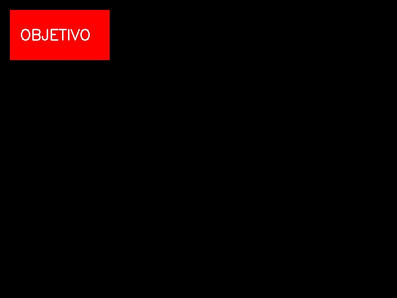
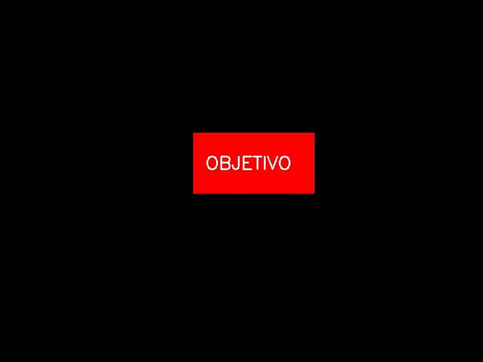
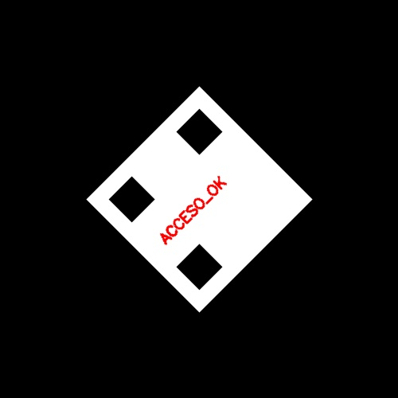
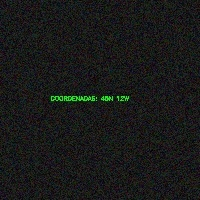
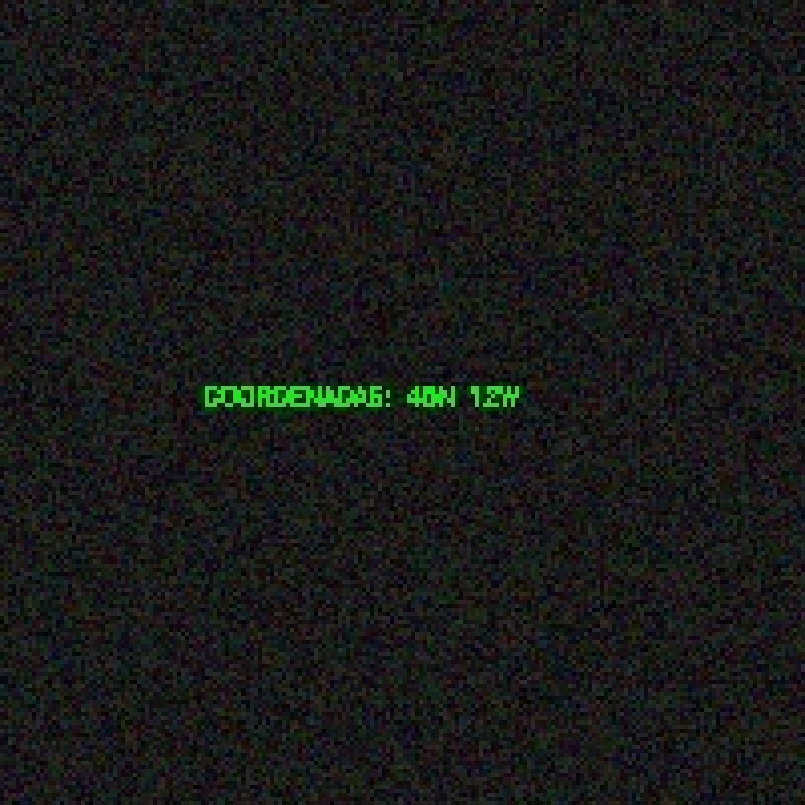
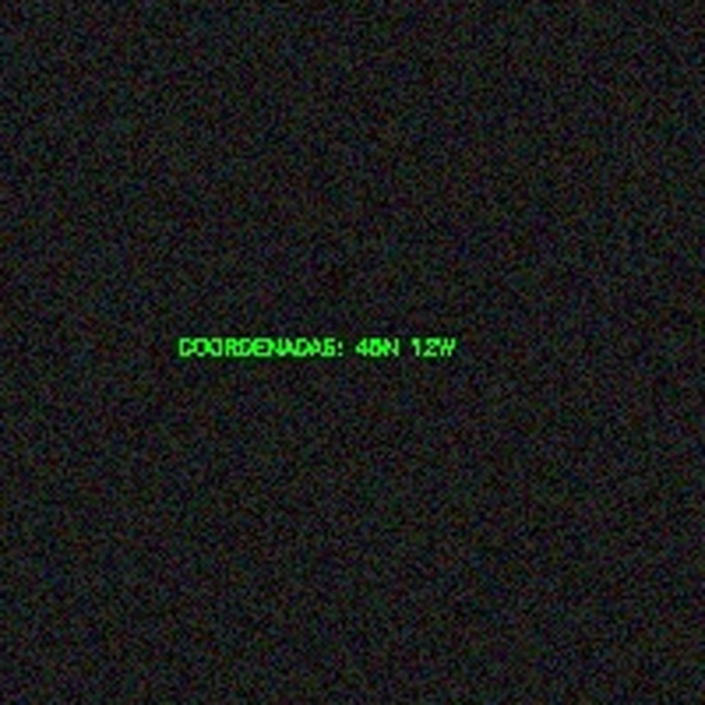

# Reporte — Transformaciones Geométricas

**Nombre:** Diego Santiago Zavala Urueta

**Profesor:** Jesus Eduardo Alcaraz Chavez

**Materia:** Graficación

---

## Misión 1 — El Artefacto Desplazado (Traslación)

### Código Operativo

```python
import cv2
import numpy as np
import time

img = cv2.imread('vehiculo.jpg')
h, w = img.shape[:2]
tx, ty = 300, 200

# Método 1: Modo Raw (Slicing de NumPy)
inicio = time.time()
lienzo_raw = np.zeros((h, w, 3), dtype=np.uint8)
lienzo_raw[ty:h, tx:w] = img[0:h-ty, 0:w-tx]
fin = time.time()
print(f"Modo Raw:    {fin - inicio:.6f} segundos")

# Método 2: Modo OpenCV
inicio = time.time()
M = np.float32([[1, 0, tx],
                [0, 1, ty]])
resultado_cv = cv2.warpAffine(img, M, (w, h))
fin = time.time()
print(f"Modo OpenCV: {fin - inicio:.6f} segundos")

cv2.imwrite('mision1_raw.jpg',    lienzo_raw)
cv2.imwrite('mision1_opencv.jpg', resultado_cv)
```

### Evidencia Visual

| Original | Raw | OpenCV |
|:-:|:-:|:-:|
|  |  |  |

### Análisis del Analista

**¿Notaste alguna diferencia de tiempo entre el Modo Raw y cv2.warpAffine?**
Sí. El Modo Raw con slicing de NumPy es considerablemente más lento que `cv2.warpAffine`. Esto se debe a que OpenCV está implementado en C++ y ejecuta las operaciones directamente sobre la memoria de forma optimizada y vectorizada. El slicing de NumPy también opera en C internamente, pero `warpAffine` además aprovecha instrucciones de bajo nivel del procesador específicamente diseñadas para transformaciones matriciales sobre imágenes.

---

## Misión 2 — El Código Mareado (Rotación)

### Código Operativo

```python
import cv2
import numpy as np
import math

img = cv2.imread('qr_rotado.jpg')
h, w = img.shape[:2]
cx, cy = 250, 250
angulo = -45
rad = math.radians(angulo)

# Método 1: Modo Raw (Trigonometría inversa)
lienzo_raw = np.zeros((h, w, 3), dtype=np.uint8)
for y_dst in range(h):
    for x_dst in range(w):
        x_c = x_dst - cx
        y_c = y_dst - cy
        x_src = int( x_c * math.cos(rad) - y_c * math.sin(rad) + cx)
        y_src = int( x_c * math.sin(rad) + y_c * math.cos(rad) + cy)
        if 0 <= x_src < w and 0 <= y_src < h:
            lienzo_raw[y_dst, x_dst] = img[y_src, x_src]

# Método 2: Modo OpenCV
M = cv2.getRotationMatrix2D((cx, cy), -45, 1.0)
resultado_cv = cv2.warpAffine(img, M, (w, h))

cv2.imwrite('mision2_raw.jpg',    lienzo_raw)
cv2.imwrite('mision2_opencv.jpg', resultado_cv)
```

### Evidencia Visual

| Original | Raw | OpenCV |
|:-:|:-:|:-:|
|  |  |  |

### Análisis del Analista

**¿Te quedaron puntos negros en el Modo Raw? ¿Por qué OpenCV no los tiene?**
No, porque se usó **mapeo inverso**: en lugar de preguntar "¿a dónde va este píxel origen?", se pregunta "¿de dónde viene este píxel destino?". Esto garantiza que cada píxel del lienzo destino reciba exactamente un color, eliminando los huecos. OpenCV aplica el mismo principio de mapeo inverso y adicionalmente usa **interpolación bilineal**, que suaviza los bordes calculando colores intermedios entre píxeles vecinos en lugar de tomar el valor exacto del píxel más cercano.

---

## Misión 3 — El Microfilm Oculto (Escalamiento)

### Código Operativo

```python
import cv2
import numpy as np

img = cv2.imread('microfilm.jpg')
h, w = img.shape[:2]
cx, cy = w // 2, h // 2
recorte = img[cy-100:cy+100, cx-100:cx+100]
rh, rw = recorte.shape[:2]
factor = 5

# Método 1: Modo Raw (Vecino más cercano)
lienzo_raw = np.zeros((rh * factor, rw * factor, 3), dtype=np.uint8)
for y in range(rh):
    for x in range(rw):
        lienzo_raw[y*factor:(y+1)*factor, x*factor:(x+1)*factor] = recorte[y, x]

# Método 2: Modo OpenCV (Interpolación cúbica)
resultado_cv = cv2.resize(recorte, None, fx=factor, fy=factor,
                          interpolation=cv2.INTER_CUBIC)

cv2.imwrite('mision3_raw.jpg',    lienzo_raw)
cv2.imwrite('mision3_opencv.jpg', resultado_cv)
```

### Evidencia Visual

| Recorte original | Raw | OpenCV |
|:-:|:-:|:-:|
|  |  |  |

### Análisis del Analista

**¿Qué diferencia hay entre el Modo Raw y OpenCV con INTER_CUBIC?**
En el Modo Raw cada píxel original se replica en un bloque de 5×5 píxeles idénticos, produciendo un efecto pixelado con bordes duros y escalonados ("efecto mosaico"). OpenCV con `INTER_CUBIC` en cambio calcula el valor de cada píxel nuevo a partir de los 16 píxeles vecinos más cercanos usando una función polinomial cúbica, generando transiciones suaves entre colores. Los píxeles "extra" que no existían en la imagen original son **estimados matemáticamente** a partir del contexto de sus vecinos, lo que resulta en bordes más suaves y texto más legible.