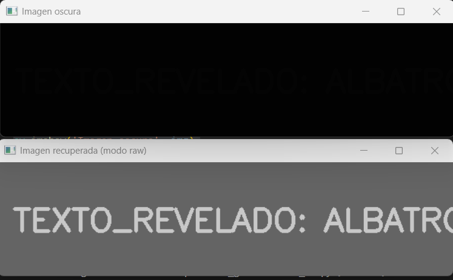
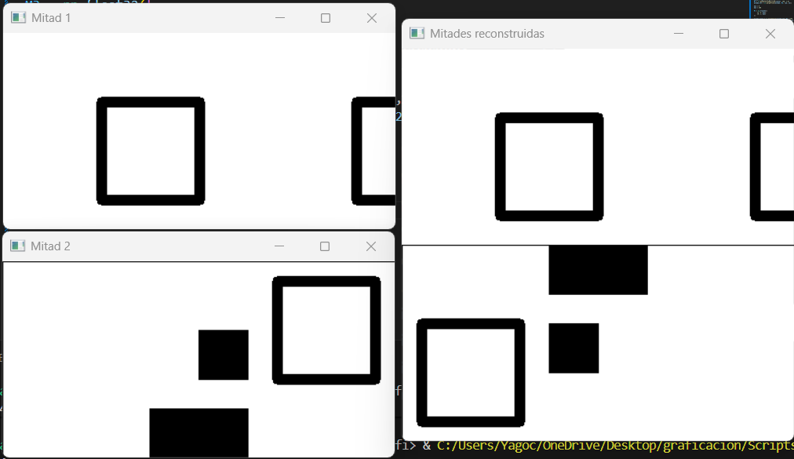
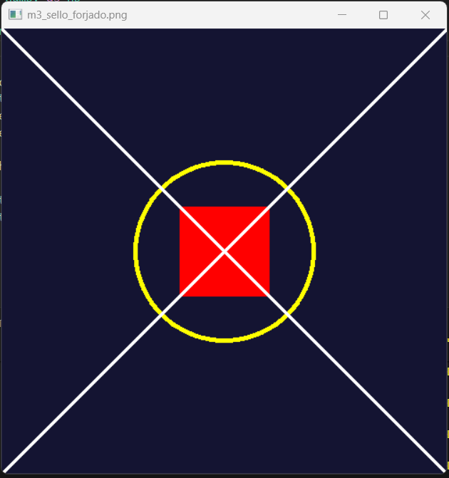
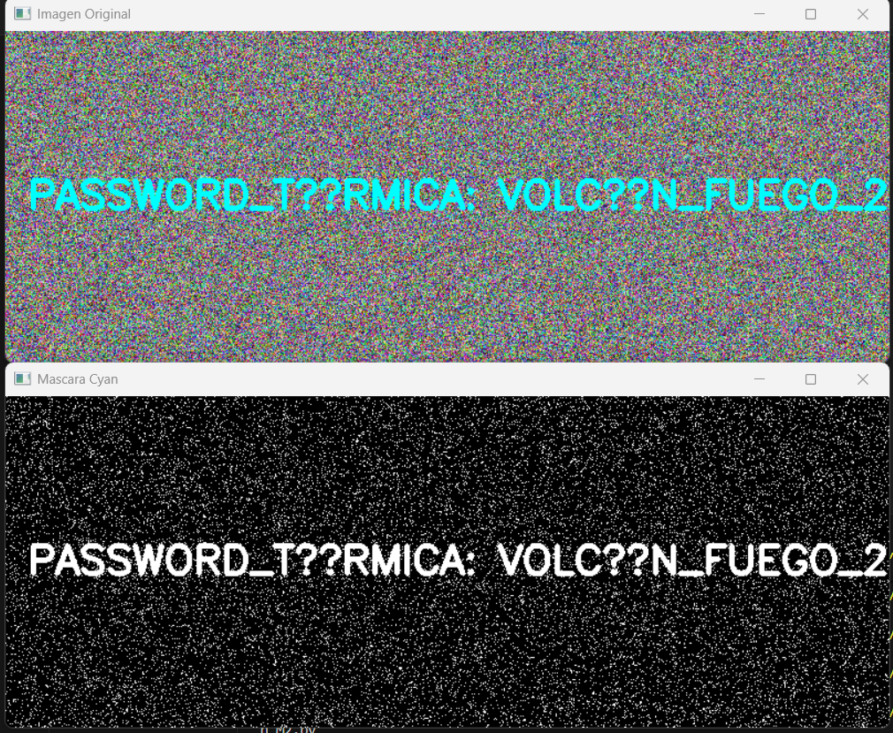
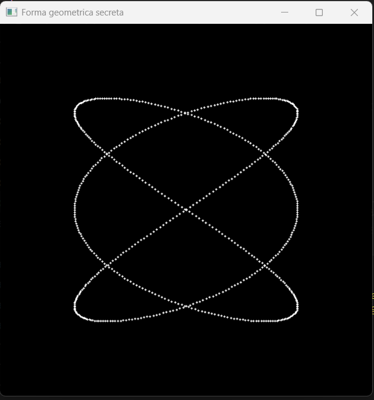

#  Reporte de Misión: Graficación Táctica
**Agente Especial:** Diego Santiago Zavala Urueta

---
##  Evidencias de Misión
*[Nota: Inserta aquí los bloques de código y las imágenes resultantes de las 5 Misiones]*

Misión 1:

    import cv2 as cv
    import numpy as np
    img = cv.imread('Imagenes/m1_oscura.png', 0)
    x, y = img.shape
    recup = np.zeros((x, y), dtype=np.uint8)
    for i in range(x):
        for j in range(y):

            val = img[i, j] * 50
            if val > 255:
                val = 255

            recup[i, j] = val

    cv.imshow('Imagen oscura', img)
    cv.imshow('Imagen recuperada (modo raw)', recup)

    cv.waitKey(0)
    cv.destroyAllWindows()

Misión 2:

    import cv2 as cv
    import numpy as np
    mitad1 = cv.imread('Imagenes/m2_mitad1.png', 0)
    mitad2 = cv.imread('Imagenes/m2_mitad2.png', 0)

    x1, y1 = mitad1.shape
    x2, y2 = mitad2.shape
    canvas = np.zeros((400, 400), dtype=np.uint8)

    dx, dy = 0, 0

    M1 = np.float32([
        [1, 0, dx],
        [0, 1, dy]
    ])

    mitad1_trans = cv.warpAffine(mitad1, M1, (400, 400))
    canvas[0:x1, 0:y1] = mitad1_trans[0:x1, 0:y1]
    center = (y2 // 2, x2 // 2)
    M2 = cv.getRotationMatrix2D(center, 180, 1.0)
    mitad2_rot = cv.warpAffine(mitad2, M2, (y2, x2))

    dx2 = 0
    dy2 = 200

    M3 = np.float32([
        [1, 0, dx2],
        [0, 1, dy2]
    ])

    mitad2_trans = cv.warpAffine(mitad2_rot, M3, (400, 400))
    canvas[200:200+x2, 0:y2] = mitad2_trans[200:200+x2, 0:y2]

    cv.imshow('Mitad 1', mitad1)
    cv.imshow('Mitad 2', mitad2)
    cv.imshow('Mitades reconstruidas', canvas)

    cv.waitKey(0)
    cv.destroyAllWindows()

Misión 3:

    import cv2 as cv
    import numpy as np

    img = np.zeros((500, 500, 3), dtype=np.uint8)
    img[:] = (50, 20, 20)

    cv.circle(img, (250, 250), 100, (0, 255, 255), 3)
    cv.rectangle(img, (200, 200), (300, 300), (0, 0, 255), -1)
    cv.line(img, (0, 0), (500, 500), (255, 255, 255), 2)
    cv.line(img, (0, 500), (500, 0), (255, 255, 255), 2)

    cv.imshow('m3_sello_forjado.png', img)

    cv.waitKey(0)
    cv.destroyAllWindows()

Misión 4:

    import cv2 as cv
    import numpy as np

    img = cv.imread('Imagenes/m4_ruido.png')

    hsv = cv.cvtColor(img, cv.COLOR_BGR2HSV)
    lower_cyan = np.array([80, 100, 100])
    upper_cyan = np.array([100, 255, 255])
    mask = cv.inRange(hsv, lower_cyan, upper_cyan)

    cv.imshow("Imagen Original", img)
    cv.imshow("Mascara Cyan", mask)
    cv.waitKey(0)
    cv.destroyAllWindows()

Misión 5:

    import numpy as np
    import cv2 as cv
    import math as m

    width, height = 500, 500
    img = np.zeros((height, width, 3), dtype=np.uint8)
    t = 0
    t_max = 6.28
    incremento = 0.01

    while t <= t_max:
        x = int(250 + 150 * m.sin(3 * t))
        y = int(250 + 150 * m.sin(2 * t))
        cv.circle(img, (x, y), 1, (255, 255, 255), -1)
        t += incremento

    cv.imshow("Forma geometrica secreta", img)
    cv.waitKey(0)
    cv.destroyAllWindows()

---
##  Análisis del Analista (Reflexiones Finales)

1. **Sobre los Operadores Puntuales (Misión 1):** Matemáticamente, ¿qué pasaría si en lugar de multiplicar por 50, hubieras sumado 50 a cada píxel oscuro? ¿Se revelaría el texto igual de claro o la imagen perdería contraste?
> *[Sin duda la imagen se vería más apagada, tal vez el texto se podría llegar a notar, pero con mucho más esfuerzo visual, esto debido que al sumar 50 solo se aumenta un poco el brillo de todos los píxeles, pero la diferencia entre ellos sigue siendo muy pequeña. En cambio, al multiplicar por 50 los valores cambian mucho más y el contraste aumenta, haciendo que el texto oculto se vea mucho más claro.]*

2. **Sobre el Espacio HSV (Misión 4):** ¿Por qué el modelo de color BGR es ineficiente para la Recuperación de Información cuando buscamos "todos los tonos de azul celeste", y por qué el modelo HSV resuelve este problema con una sola variable?
> *[El modelo BGR no es muy bueno para buscar colores específicos porque el mismo color puede tener valores diferentes dependiendo de la iluminación o qué tan fuerte sea el color, sin embargo, en el modelo HSV el color se separa mejor, por eso es más fácil encontrar todos los tonos de celeste  usando solo un rango de esa variable.]*

3. **Sobre Ecuaciones Paramétricas (Misión 5):** ¿Por qué las ecuaciones paramétricas (usando el parámetro t) son mejores para dibujar formas cerradas y complejas en graficación por computadora que usar la clásica función $y=f(x)$?
> *[Las ecuaciones paramétricas son mejores para dibujar figuras complejas porque permiten calcular al mismo tiempo las posiciones de x y de y usando un mismo valor t, así se puede ir recorriendo la figura poco a poco y dibujar curvas completas o cerradas, en cambio, con una función normal como y = f(x) es más difícil hacer formas que se cruzan o que regresan sobre sí mismas, por lo que no es tan práctica para dibujar figuras complejas en la computadora.]*