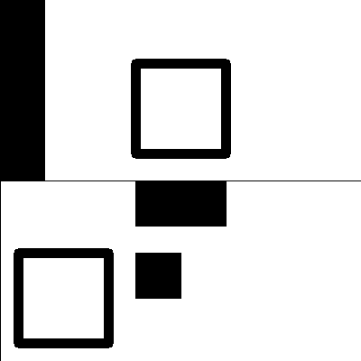
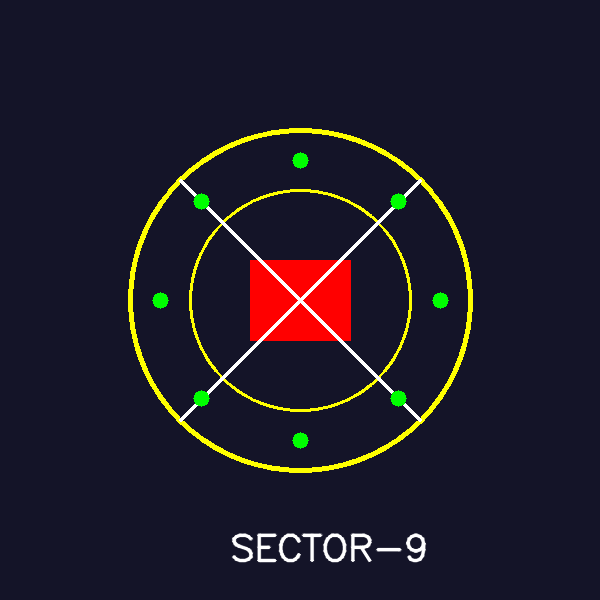
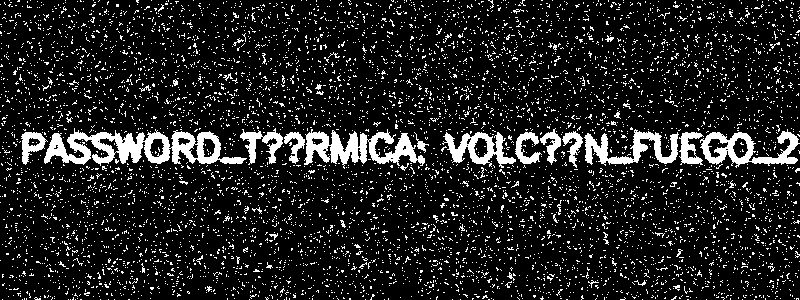
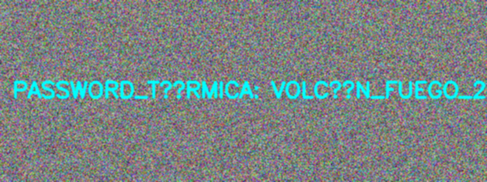
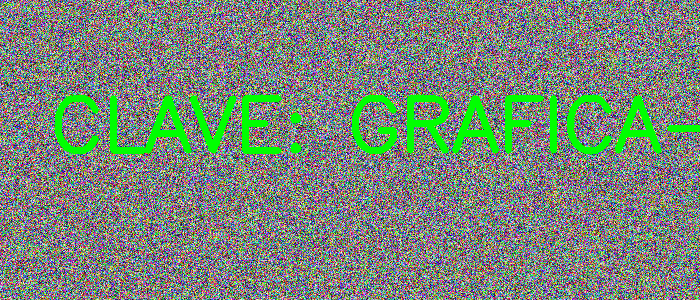
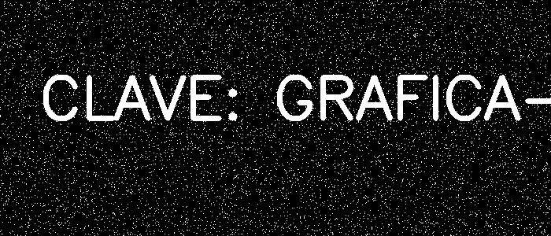

# Reporte de Misión: Graficación Táctica II
**Agente Especial:** [Diego Santiago Zavala Urueta/24120396]

---
## Evidencias
### Misión 1
- Imagen recuperada x50:

- Imagen recuperada x50 + 20:

- Código:

        import cv2
        import numpy as np

        img = cv2.imread("Imagenes/m1_oscura 1.png", cv2.IMREAD_GRAYSCALE)

        img_int = img.astype(np.int32)
        alto, ancho = img.shape
        recuperado_x50 = np.zeros((alto, ancho), dtype=np.int32)

        for y in range(alto):
            for x in range(ancho):
                valor = img_int[y, x] * 50
                valor = np.clip(valor, 0, 255)
                recuperado_x50[y, x] = valor

        recuperado_x50 = recuperado_x50.astype(np.uint8)

        recuperado_x50_mas20 = np.zeros((alto, ancho), dtype=np.int32)

        for y in range(alto):
            for x in range(ancho):
                valor = recuperado_x50[y, x] + 20
                valor = np.clip(valor, 0, 255)
                recuperado_x50_mas20[y, x] = valor

        recuperado_x50_mas20 = recuperado_x50_mas20.astype(np.uint8)

        vec_x50 = np.clip(img.astype(np.int32) * 50, 0, 255).astype(np.uint8)
        vec_x50_mas20 = np.clip(vec_x50.astype(np.int32) + 20, 0, 255).astype(np.uint8)

        cv2.imshow("Original", img)
        cv2.imshow("RAW x50", recuperado_x50)
        cv2.imshow("RAW x50 + 20", recuperado_x50_mas20)
        cv2.imshow("Vectorizado x50", vec_x50)
        cv2.imshow("Vectorizado x50 + 20", vec_x50_mas20)

        cv2.waitKey(0)
        cv2.destroyAllWindows()

### Misión 2
- QR reconstruido:

- Código:

        import cv2
        import numpy as np

        mitad1 = cv2.imread("Imagenes/m2_mitad1.png")
        mitad2 = cv2.imread("Imagenes/m2_mitad2.png")

        lienzo = np.full((400, 400, 3), 255, dtype=np.uint8)

        h1, w1 = mitad1.shape[:2]
        M1 = np.float32([[1, 0, 50], [0, 1, 0]])
        mitad1_enderezada = cv2.warpAffine(mitad1, M1, (w1, h1))
        lienzo[0:h1, 0:w1] = mitad1_enderezada

        h2, w2 = mitad2.shape[:2]
        centro = (w2 // 2, h2 // 2)
        M2 = cv2.getRotationMatrix2D(centro, 180, 1.0)
        mitad2_enderezada = cv2.warpAffine(mitad2, M2, (w2, h2))

        lienzo[h1:h1+h2, 0:w2] = mitad2_enderezada

        cv2.imshow("QR Reconstruido", lienzo)

        cv2.waitKey(0)
        cv2.destroyAllWindows()

### Misión 3
- Sello forjado:

- Código:

        import cv2
        import numpy as np
        import math

        img = np.zeros((600, 600, 3), dtype=np.uint8)
        img[:] = (40, 20, 20)

        centro = (300, 300)
        amarillo = (0, 255, 255)
        rojo = (0, 0, 255)
        blanco = (255, 255, 255)
        verde = (0, 255, 0)

        cv2.circle(img, centro, 170, amarillo, 3)

        cv2.circle(img, centro, 110, amarillo, 2)

        cv2.rectangle(img, (250, 260), (350, 340), rojo, cv2.FILLED)

        cv2.line(img, (300-120, 300-120), (300+120, 300+120), blanco, 2)
        cv2.line(img, (300+120, 300-120), (300-120, 300+120), blanco, 2)

        for i in range(8):
            angulo = i * (2 * math.pi / 8)
            x = int(centro[0] + 140 * math.cos(angulo))
            y = int(centro[1] + 140 * math.sin(angulo))
            cv2.circle(img, (x, y), 8, verde, cv2.FILLED)

        font = cv2.FONT_HERSHEY_SIMPLEX
        cv2.putText(img, "SECTOR-9", (230, 560), font, 1.2, blanco, 2, cv2.LINE_AA)

        cv2.imshow("M3 Sello Forjado", img)

        cv2.waitKey(0)
        cv2.destroyAllWindows()

### Misión 4
- Máscara Cyan:

- Suavizada:

- Código:

        import cv2
        import numpy as np

        img = cv2.imread("Imagenes/m4_ruido.png")

        kernel = np.array([[1, 1, 1],
                        [1, 1, 1],
                        [1, 1, 1]], dtype=np.float32) / 9.0

        img_suavizada = cv2.filter2D(img, -1, kernel)

        hsv = cv2.cvtColor(img_suavizada, cv2.COLOR_BGR2HSV)

        lower_cyan = np.array([80, 50, 50])
        upper_cyan = np.array([100, 255, 255])

        mask_cyan = cv2.inRange(hsv, lower_cyan, upper_cyan)

        cv2.imshow("Original", img)
        cv2.imshow("Mascara Cyan", mask_cyan)
        cv2.imshow("Suavizada (Filtro 3x3)", img_suavizada)

        cv2.waitKey(0)
        cv2.destroyAllWindows()

### Misión 5
- Evidencia tricolor:

- Mensaje recuperado:

- Código:

        import cv2
        import numpy as np

        img = np.random.randint(0, 256, (300, 700, 3), dtype=np.uint8)

        texto = "CLAVE: GRAFICA-2026"
        cv2.putText(img, texto, (50, 150), cv2.FONT_HERSHEY_SIMPLEX, 2.5, (0, 255, 0), 5)

        b, g, r = cv2.split(img)

        res_diff = cv2.absdiff(g, b)

        _, mensaje_final = cv2.threshold(res_diff, 200, 255, cv2.THRESH_BINARY)

        cv2.imshow("Original (m5_tricolor)", img)
        cv2.imshow("Canal G (Pista)", g)
        cv2.imshow("Diferencia abs(G-B)", res_diff)
        cv2.imshow("Mensaje Recuperado", mensaje_final)

        cv2.waitKey(0)
        cv2.destroyAllWindows()

---
## Análisis del Analista (Reflexiones Finales)

1. **Operadores puntuales (M1):** ¿Qué diferencia visual hay entre recuperar con multiplicación (x50) y recuperar con suma (+50)? ¿Cuál preserva mejor el contraste del texto?
> *[La multiplicación por un factor (x50) actúa como un amplificador de ganancia que expande la distancia de intensidad entre los píxeles, logrando una diferenciación clara entre el fondo y la información oculta, lo que preserva el contraste. Por el contrario, la suma (+50) realiza un desplazamiento (offset) sobre todo el histograma, elevando el brillo de forma uniforme; esto suele resultar en una imagen con menor contraste donde el ruido de fondo se vuelve tan brillante como el texto, dificultando su legibilidad. Por tanto, la multiplicación es superior para recuperar información oculta porque escala las diferencias relativas en lugar de simplemente añadir luz.]*

2. **Transformaciones geométricas (M2):** ¿Por qué es importante escoger el centro correcto al rotar una imagen con `getRotationMatrix2D`?
> *[El centro de rotación definido en la matriz es el eje sobre el cual se realiza la rotación de las coordenadas cartesianas de cada píxel. Si se utiliza un centro arbitrario (como el origen 0,0) en lugar del centro geométrico de la imagen, la transformación provoca una traslación involuntaria que desplaza la figura fuera del área útil del lienzo. Escoger el centro correcto es lo que garantiza que la rotación sea pura, manteniendo la integridad espacial de la imagen dentro del sistema de coordenadas del lienzo.]*

3. **Convolución (M4):** ¿Por qué un filtro promedio puede ayudar a reducir falsos positivos antes de segmentar por HSV, y qué desventaja tiene sobre los bordes del texto?
> *[El filtro promedio funciona como un paso de baja frecuencia que atenúa las variaciones de alta frecuencia, es decir, el ruido aleatorio (píxeles aislados que distan del color objetivo). Al promediar el valor de un píxel con su vecindad, se eliminan estos valores atípicos que causarían "falsos positivos" en la máscara de segmentación. La desventaja técnica es que el filtro actúa como un desenfoque (blur), lo que reduce la nitidez de los bordes; al promediar colores del texto con colores del fondo, los bordes se vuelven ambiguos, pudiendo causar pérdida de detalles finos o conexiones erróneas en objetos muy próximos.]*

4. **Canales (M5):** ¿Por qué separar canales puede revelar información que en la imagen a color “no se ve” a simple vista?
> *[La representación BGR es una superposición de tres planos donde, frecuentemente, la señal de interés está oculta en un solo canal mientras los otros actúan como ruido cromático o de luminancia. La visión humana tiende a integrar los tres canales en una sola percepción de color, lo que oculta los valores discretos de cada matriz individual. Al separar los canales, eliminamos la interferencia de la superposición, permitiendo aplicar operaciones matemáticas de comparación —como la diferencia absoluta— que resaltan la discrepancia entre el canal portador del mensaje y el canal de ruido, exponiendo información que la síntesis aditiva original mantenía latente.]*